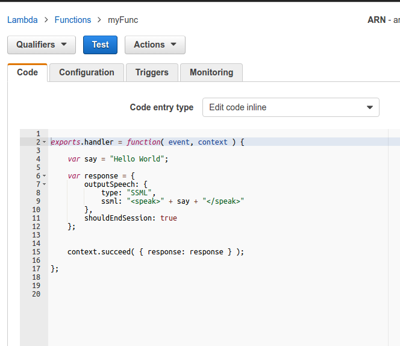
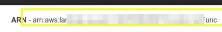
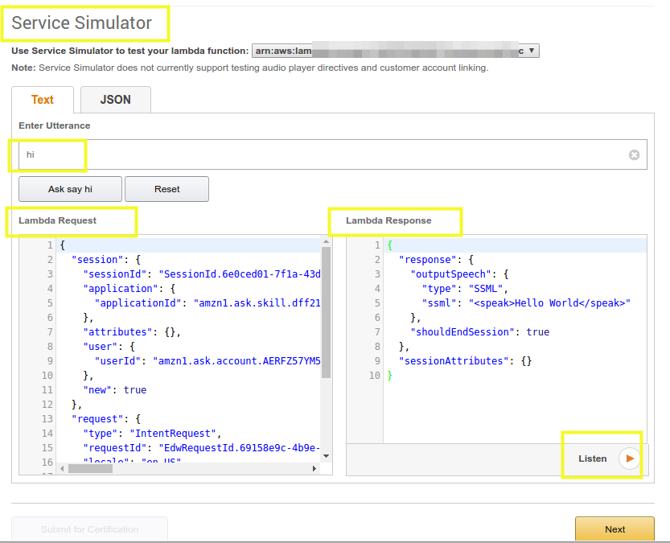

# aws_hello_alexa

#Simple Hello World Amazon Alexa Skill

Creating an Alexa Hello World skill requires an Amazon Developer Account and An Amazon AWS account.

Next write the functionality of the skill. This is the code you write that will interact with the Alexa service.

In this case, write a simple ```myFunc.js ``` in Sublime Text:

```
exports.handler = function( event, context ) {

    var say = "Hello World";

    var response = {
        outputSpeech: {
            type: "SSML",
            ssml: "<speak>" + say + "</speak>"
        },
        shouldEndSession: true
    };


    context.succeed( { response: response } );

};
```

This func should go to the lambda function in aws.


Take note of the ARN number on the upper right hand corner of this page. You will need it later when you configure the Alexa service.


### Amazon Developer Account
Go to Amazon Developer portal https://developer.amazon.com/: 
click on ```Add a New Skill```

Finish the Name and the Invocation Name for the skill.

####Interaction Model
This is where you put two sets of Speech Assets: the Intent Schema and the Sample Utterances.


####Configuration
In configuration, you can set the endpoint. In this case we are using the AWS lambda service. This is where you set the endpoint of the service. 

Since we are using the AWS Lambda service, we indicate 
the endpoint by choosing AWN Lambda Resource Name (ARN)

Then pick the North American geographic region. Enter the ARN number at the text box.

####Test 
In this last section, go to the bottom (Service Simulator),

At the Text section, enter one of the utterances you wrote in.

If all is well, the Lambda Request will be created via a JSON object. The Lambda Respone will indicate the response. 

